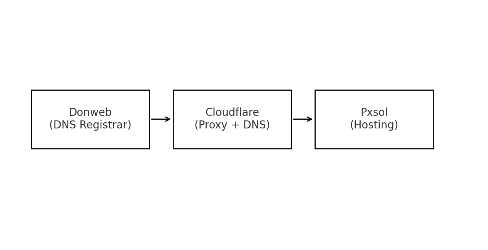
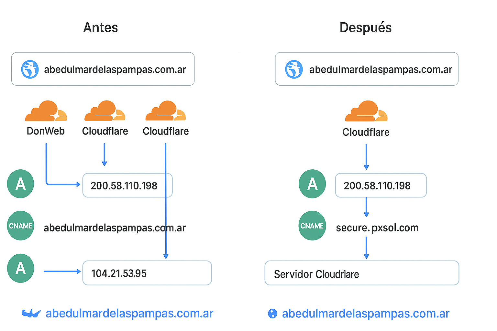
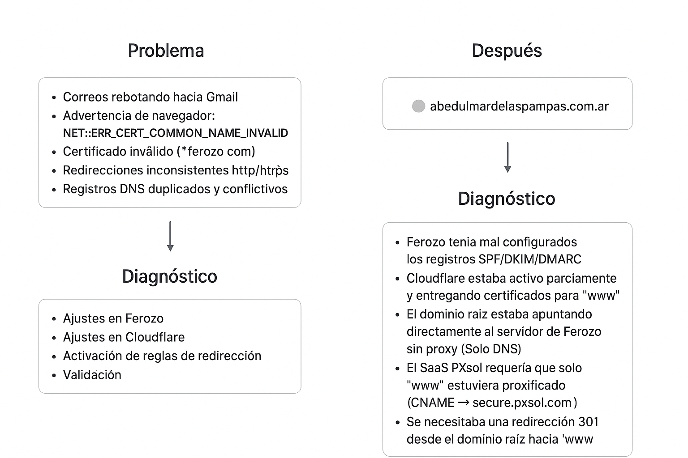
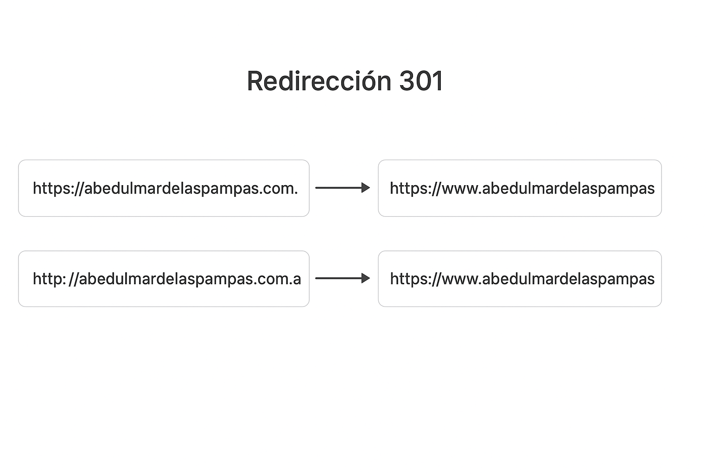

# Resolución de configuración DNS + SSL entre DonWeb, Cloudflare y PXsol

Este repositorio documenta el proceso completo de diagnóstico, resolución y estabilización de un sitio web que presentaba errores de certificado SSL, correos mal configurados, problemas de redirección y configuraciones conflictivas entre tres proveedores:

- **DonWeb (Ferozo)** – servidor de hosting y DNS original
- **Cloudflare** – CDN, SSL y proxy
- **PXsol** – sistema SaaS externo al que apunta el dominio (secure.pxsol.com)

---

## Problema inicial

El dominio 'abedulmardelaspampas.com.ar' presentaba:

- Correos rebotando hacia Gmail.
- Advertencia de navegador: `NET::ERR_CERT_COMMON_NAME_INVALID`
- Certificado inválido (*.ferozo.com) cuando se accedía sin www
- Redirecciones inconsistentes http/https
- Registros DNS duplicados y conflictivos
- SSL válido solo para el subdominio www, no para el dominio raíz

---

## Diagnóstico
1. Ferozo tenia mal configurados los registros SPF/DKIM/DMARC.
2. Cloudflare estaba activo parcialmente y entregando certificados para `www`.
3. El dominio raíz estaba apuntando directamente al servidor de Ferozo sin proxy (Solo DNS).
4. El SaaS PXsol requería que solo `www` estuviera proxificado (CNAME → secure.pxsol.com).
5. El dominio raíz no podía tener un SSL válido del lado del servidor remoto.
6. Se necesitaba una redirección 301 desde el dominio raíz hacia `www`.

---

## Solución implementada

### Ajustes en Ferozo
- Creación de registro SPF
- Creación de registro DKIM
- Creación de registro DMARC

### Ajustes en Cloudflare
- Configuración de registros SPF, DKIM, DMARC
- Registro **A (@)** configurado en **Redirigido mediante proxy**
- Registro **CNAME (www)** configurado en **Redirigido mediante proxy** apuntando a 'secure.pxsol.com'
- SSL en modo **Full**
- Activación de reglas de redirección:

**Regla 1 — https -> www**
https://abedulmardelaspampas.com.ar/* -> https://www.abedulmardelaspampas.com.ar/$1 (301)

**Regla 2 — http -> https + www**
http://abedulmardelaspampas.com.ar/* -> https://www.abedulmardelaspampas.com.ar/$1 (301)

### Validación
- Accesos correctos con y sin www
- Redirección automática a versión segura
- Sitio servido correctamente desde PXsol detrás del proxy de Cloudflare
- Correos electrónicos OK (SPF, DKIM, DMARC verificados)
- Propagación DNS completa

---

## Resultado

El sitio quedó funcionando en todas sus variantes:
- mails salientes y entrantes ok! para cualquier cliente de correo 
- http -> redirige a https  
- dominio sin www -> redirige a www  
- certificado HTTPS válido del lado de Cloudflare  
- navegación sin advertencias de seguridad  
- plataforma hotelera PXsol funcionando detrás del proxy sin problemas  

---

## Habilidades aplicadas

- Ferozo (SPF/DKIM/DMARC)
- Administración DNS avanzada  
- Cloudflare (SSL, Proxy, Rules, Redirects)  
- Depuración de errores SSL  
- Análisis de infraestructura multi-proveedor  
- Coordinación técnica con soporte de hosting  
- Documentación del proceso y comunicación con cliente  

---

## Diagramas

Este repo incluye diagramas de flujo y arquitectura DNS que ilustran el antes y después
de la resolución.

*Figura 1 — Flujo de DNS*

*Figura 2 — Antes vs Despues dns y ssl diagrama de arquitectura*

*Figura 3 — Proceso de problema, diagnóstico y solución*

*Figura 4 — Redirecciones 301 configuradas en Cloudflare*
